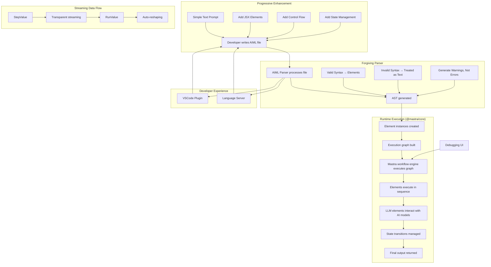

# Product Context: AIML

## Why This Project Exists:

AIML addresses the growing need for structured, reliable interactions with large language models in production applications. It provides a "light touch" solution that allows developers to start with simple prompts and progressively enhance them with more structure as needed, rather than forcing them into a rigid framework from the beginning.

## Problems It Solves:

1. **Prompt Engineering Complexity:** Replaces ad-hoc prompt engineering with a structured, declarative approach that can be as simple or complex as needed
2. **Barrier to Entry:** Lowers the barrier to entry by treating all content as "just text" by default, allowing developers to start simple and add complexity gradually
3. **State Management:** Provides robust state management for multi-turn AI interactions
4. **Developer Experience:** Improves the developer experience with proper tooling, syntax highlighting, and debugging capabilities
5. **Workflow Orchestration:** Enables complex AI workflows with proper control flow, error handling, and state transitions
6. **Code Organization:** Facilitates better organization of AI interaction logic through modular, reusable components
7. **Maintainability:** Makes AI-powered applications more maintainable through clear separation of concerns and structured code
8. **Streaming Complexity:** Eliminates the complexity of managing streaming vs. non-streaming data flows, allowing developers to focus on business logic rather than data handling mechanics

## How It Should Work:

1. Developers write AIML files using as much or as little of the markup language as needed
2. Simple prompts work without modification, while more complex interactions can leverage JSX-style elements
3. The AIML parser treats invalid syntax as plain text rather than throwing errors, producing warnings instead
4. The parser generates diagnostics that are used by both the runtime and the language server/VSCode plugin
5. The runtime (built on @mastra/core) builds an execution graph from the parsed elements
6. The Mastra workflow engine executes the graph, managing state transitions and element execution
7. StepValue and RunValue objects handle streaming data flow transparently between components
8. Elements like LLM interact with AI models and process their responses
9. The system provides proper error handling, debugging information, and state visibility

## Data Flow Architecture

At the heart of AIML's architecture are two critical components that enable its flexible, streaming-first approach:

### StepValue: The Atomic Unit of Data

StepValue solves the fundamental challenge of representing and transforming data as it flows through the system:

- **Unified Data Representation**: Provides a consistent interface for all data types
- **Transparent Streaming**: Abstracts away the complexities of streaming vs. non-streaming data
- **Type Safety**: Ensures data integrity throughout the execution flow
- **Value Transformation**: Enables automatic conversion between different data formats
- **Error Propagation**: Standardizes error handling across the system

For developers, StepValue means never having to worry about whether data is streaming or not - the system handles this complexity automatically.

### RunValue: The Execution Interface

RunValue revolutionizes how workflow execution results are consumed:

- **Non-Blocking Execution**: Returned immediately when a workflow starts, not when it completes
- **Complete Execution Record**: Captures every step's input and output throughout the workflow
- **Real-Time Updates**: Streams execution progress as it happens
- **Flexible Output Patterns**: Supports multiple consumption patterns through a single API:
  - **Final-Only Mode**: Only process the final output, ignoring intermediate steps
  - **Reasoning Mode**: Format intermediate steps as reasoning/thinking in <think> tags, followed by the final output
  - **Debug Mode**: Access the complete execution trace with timing and state information
  - **Custom Transformations**: Apply custom transformations to the execution data

This approach creates a powerful separation of concerns:

1. The workflow defines what to execute
2. The runtime handles how to execute it
3. RunValue determines how to present the results

This separation enables the same workflow to be consumed differently based on the use case - from simple API responses to rich debugging interfaces to chain-of-thought reasoning patterns.

## User Experience Goals:

1. **Progressive Enhancement:** Allow developers to start with simple prompts and add structure incrementally
2. **Forgiving Syntax:** Ensure that syntax errors don't break execution but are treated as plain text
3. **Intuitive Markup:** Developers should find the AIML syntax intuitive and easy to learn
4. **Powerful Tooling:** VSCode plugins and language server should provide rich feedback and assistance
5. **Debugging Capabilities:** The debugging UI should make it easy to understand workflow execution and diagnose issues
6. **Flexibility:** The system should be flexible enough to accommodate a wide range of AI interaction patterns
7. **Performance:** Runtime execution should be efficient and scalable
8. **Transparent Data Flow:** Developers should not need to worry about whether data is streaming or not between components - the system handles this transparently

## Value Proposition / Key Benefits:

1. **Low Barrier to Entry:** Start with simple prompts and add structure only when needed
2. **Forgiving Implementation:** Invalid syntax is treated as text rather than causing errors
3. **Structured AI Interactions:** Replace ad-hoc prompt engineering with a structured, maintainable approach
4. **Developer Productivity:** Increase developer productivity through better tooling and workflow management
5. **Code Quality:** Improve code quality and maintainability through proper separation of concerns
6. **Reliability:** Enhance the reliability of AI-powered applications through proper state management and error handling
7. **Extensibility:** Provide an extensible platform that can grow with evolving AI capabilities
8. **Simplified Data Handling:** Abstract away the complexities of streaming vs. non-streaming data, with future capabilities for automatic data reshaping between nodes

## Technical Implementation:

### Architecture Diagram

