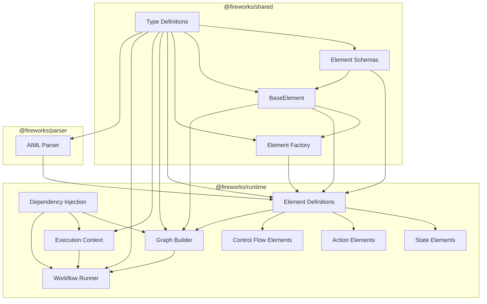

# AIML Architecture Documentation

## Overview

The AIML architecture has been refactored to address several issues with the previous design, including circular dependencies, duplicate type definitions, tight coupling, and complex type relationships. This document describes the new architecture and the patterns used to implement it.

## Architecture Diagram



## Package Structure

The codebase is organized into the following packages:

- **@fireworks/shared**: Contains the base element class and factory.
- **@fireworks/runtime**: Contains the runtime execution engine. Depends on @fireworks/shared,
- **@fireworks/parser**: Responsible for parsing AIML files and creating element instances. Depends on @fireworks/shared.

## Key Components

### Types Package

The types package defines all the types used throughout the codebase. It includes:

- **SerializedBaseElement**: The base interface for all serialized elements (renamed from AIMLNode).
- **SerializedElement**: The interface for serialized elements (renamed from IBaseElement).
- **ElementType**: The type of an element (e.g., "state", "action", etc.).
- **ElementRole**: The role of an element (e.g., "state", "action", etc.).
- **ExecutionGraphElement**: The interface for elements in the execution graph.
- **BuildContext**: The context for building execution graphs.
- **ElementExecutionContext**: The context for executing elements.

### Element Config Package

The element-config package defines the schemas for all elements. It includes:

- **BaseElementDefinition**: The base interface for element definitions.
- **ElementDefinition**: The interface for specific element definitions.
- **Element schemas**: Schemas for all element types (e.g., state, action, etc.).

### Element Core Package

The element-core package is responsible for defining the base element class and factory. It includes:

- **BaseElement**: The base class for all elements.
- **Element Factory**: A factory for creating elements.

### Elements Package

The elements package contains specific element implementations. It includes:

- **Element Definitions**: Definitions for all element types.
- **State Elements**: Elements for defining states (e.g., state, parallel, final).
- **Action Elements**: Elements for defining actions (e.g., assign, log, send).
- **Control Flow Elements**: Elements for defining control flow (e.g., if, else, transition).

### Runtime Package

The runtime package is responsible for executing elements and managing the workflow. It includes:

- **Dependency Injection**: A simple DI container for managing dependencies.
- **Graph Builder**: Responsible for building execution graphs from elements.
- **Execution Context**: The context for executing elements.
- **Workflow Runner**: Responsible for running workflows.

### Parser Package

The parser package is responsible for parsing AIML files and creating element instances. It includes:

- **AIML Parser**: Parses AIML files and creates element instances.
- **Validator**: Validates AIML files against schemas.
- **Transformer**: Transforms AIML AST to element instances.

The parser package depends on the types package, the element-config package, the element-core package, and the elements package.

## Design Patterns

The following design patterns are used in the architecture:

### Factory Pattern

The factory pattern is used to create elements. The `createElementFactory` function creates a factory for a specific element type. The factory provides methods for creating elements from attributes and nodes, and from serialized elements.

```typescript
// Create a factory for a specific element type
const factory = createElementFactory({
  tag: "state",
  role: "state",
  elementType: "state",
  propsSchema: stateSchema,
  description: "A state element",
  documentation: "A state element",
  allowedChildren: ["state", "transition"],
});

// Create an element from attributes and nodes
const element = factory.initFromAttributesAndNodes({ id: "state1" }, []);
```

### Dependency Injection

Dependency injection is used to manage dependencies between components. The `container` object provides methods for registering and retrieving services.

```typescript
// Register a service
container.register(ServiceIdentifiers.GRAPH_BUILDER, new GraphBuilder());

// Get a service
const graphBuilder = container.get<GraphBuilder>(
  ServiceIdentifiers.GRAPH_BUILDER
);
```

### Builder Pattern

The builder pattern is used to build execution graphs from elements. The `GraphBuilder` class provides methods for building execution graphs.

```typescript
// Build an execution graph
const graph = graphBuilder.buildGraph(rootElement);
```

### Context Pattern

The context pattern is used to provide context for executing elements. The `ExecutionContext` class provides methods for executing elements and managing the execution context.

```typescript
// Create an execution context
const context = new ExecutionContext({
  input: new StepValue(input),
  workflowInput,
  datamodel,
  attributes,
  state,
  machine,
  run,
});

// Execute an element
const result = await element.execute(context, children);
```

## Dependency Flow

The dependency flow in the architecture is as follows:

1. The types package has no dependencies.
2. The element-config package depends only on the types package.
3. The element-core package depends on the types package and the element-config package.
4. The elements package depends on the types package, the element-config package, and the element-core package.
5. The runtime package depends on the types package, the element-core package, and the elements package.
6. The parser package depends on the types package, the element-config package, the element-core package, and the elements package.

This dependency flow ensures that there are no circular dependencies between packages. The clear direction of dependencies makes the codebase more maintainable and easier to reason about.

## Conclusion

The new architecture addresses the issues with the previous design by:

- Consolidating type definitions in the types package.
- Creating clear package boundaries.
- Using dependency injection to decouple components.
- Separating element definition from execution logic.
- Implementing proper lifecycle hooks for elements.

These changes make the codebase more maintainable, extensible, and easier to reason about.
