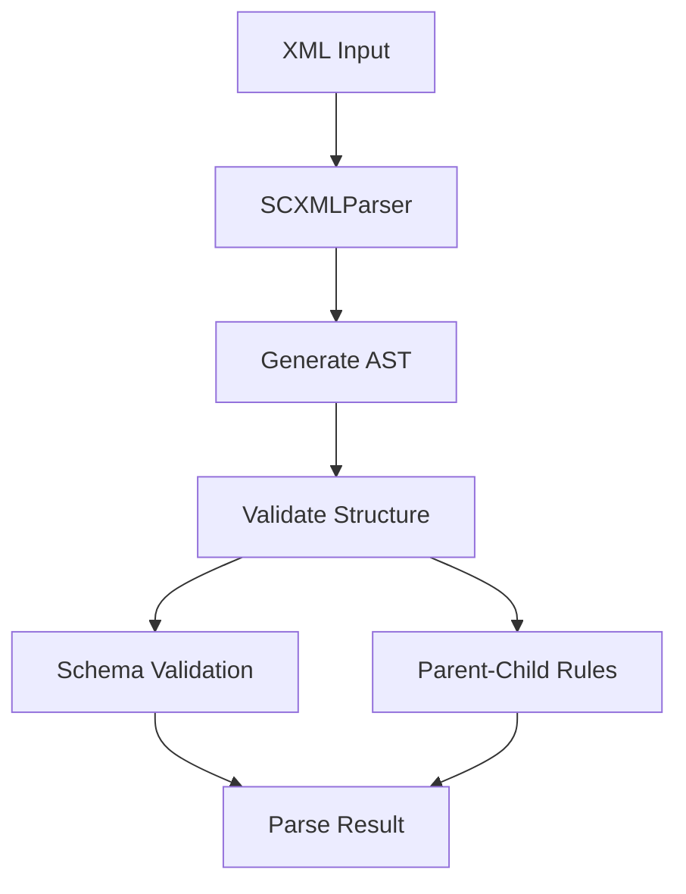

# Parser Package

## Overview

The `@scxml/parser` package provides XML parsing and validation capabilities specifically designed for SCXML files. It implements schema-based validation using Zod and enforces parent-child relationship rules.

## Core Features

1. XML Parsing

   - Parses SCXML XML syntax
   - Builds AST representation
   - Tracks line and column numbers
   - Handles element attributes

2. Schema Validation

   - Uses Zod schemas for type safety
   - Validates element attributes
   - Enforces required/optional fields
   - Provides detailed error messages

3. Relationship Validation
   - Enforces parent-child rules
   - Validates element nesting
   - Checks required parent elements
   - Ensures valid child elements

## Usage

```typescript
import { SCXMLParser } from "@scxml/parser";

const parser = new SCXMLParser(elementTypes, {
  strict: true,
  validateSchema: true,
});

const result = parser.parse(xmlContent);
```

## Architecture



## Implementation Details

1. Parser Class

   - Handles XML parsing
   - Manages error collection
   - Coordinates validation

2. Types

   - ElementType: Schema and relationship rules
   - ParseResult: AST and errors
   - SCXMLNode: AST node structure

3. Validation
   - Schema-based attribute validation
   - Parent-child relationship checks
   - Error reporting with locations

## Integration Points

1. VSCode Plugin

   - Provides parsing for language server
   - Enables real-time validation
   - Supports hover information

2. Core Package
   - Used for runtime validation
   - Supports element type definitions
   - Enables schema reuse
