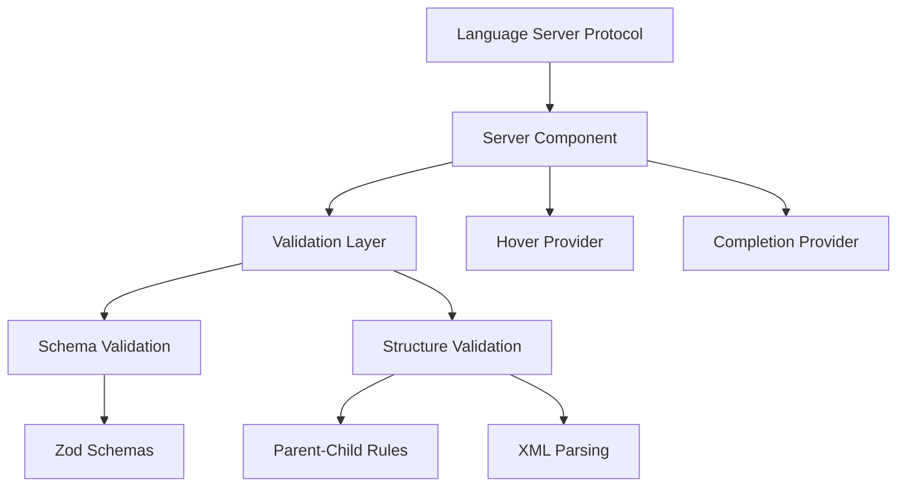

# System Patterns

## Architecture Overview



## Core Patterns

1. Schema-First Design

   - Zod schemas define both validation and documentation
   - Single source of truth for element attributes
   - Schema descriptions drive hover information
   - Type safety through Zod validation

2. Element Structure

   ```typescript
   interface ElementType {
     schema: z.ZodObject<any>; // Validation & docs
     description: string; // Element description
     allowedChildren?: string[]; // Valid children
     requiredParent?: string[]; // Valid parents
     isRoot?: boolean; // Root element flag
   }
   ```

3. Validation Strategy
   - XML structure validation using regex
   - Parent-child relationship validation
   - Attribute validation through Zod schemas
   - Error reporting with precise ranges

## Design Decisions

1. Schema Integration

   - Why: Combine validation and documentation
   - How: Zod schemas with descriptions
   - Benefit: Single source of truth
   - Impact: Simplified maintenance

2. Attribute Handling

   - Why: Remove duplication
   - How: Shared schemas for common attributes
   - Benefit: Consistent validation and documentation
   - Impact: Centralized type definitions

3. Error Reporting
   - Why: Developer experience
   - How: Precise error ranges
   - Benefit: Clear feedback
   - Impact: Faster debugging

## Component Relationships

1. Server Component

   - Handles LSP communication
   - Manages document state
   - Coordinates providers

2. Validation Layer

   - XML structure validation
   - Schema validation
   - Parent-child validation

3. Hover Provider

   - Element documentation
   - Attribute descriptions
   - Relationship info

4. Completion Provider
   - Context-aware suggestions
   - Schema-based attributes
   - Valid child elements

## Implementation Guidelines

1. Schema Definition

   ```typescript
   // Common attribute schemas
   const idSchema = z.string().describe("Unique identifier");
   const exprSchema = z.string().describe("Expression evaluation");

   // Element schema using shared attributes
   const stateSchema = z.object({
     id: idSchema.optional(),
     initial: z.string().optional().describe("Initial substate"),
   });
   ```

2. Validation

   ```typescript
   // Validate attributes
   const result = schema.safeParse(attributes);

   // Check parent-child
   if (parentDef?.allowedChildren) {
     validateChildren(parent, child);
   }
   ```

3. Documentation

   ```typescript
   // Extract descriptions
   const description = schema.description;

   // Format hover
   const hover = formatMarkdown(description);
   ```

## Error Handling

1. Validation Errors

   - Schema validation failures
   - Invalid parent-child relationships
   - Missing required attributes

2. Error Reporting

   - Precise error locations
   - Clear error messages
   - Actionable feedback

3. Recovery Strategy
   - Continue parsing after errors
   - Report all errors found
   - Maintain editor functionality
