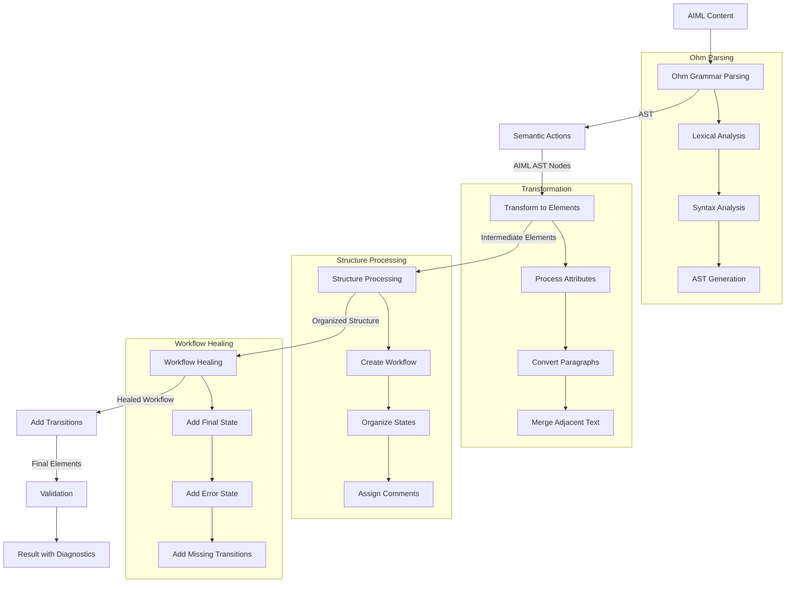

# @aiml/parser

A comprehensive parser for AIML (AI Markup Language) that converts MDX-like content into structured AIML nodes. The parser uses [Ohm.js](https://ohmjs.org/) for grammar-based parsing and provides a robust transformation pipeline for creating executable AIML workflows.

## Table of Contents

- [Overview](#overview)
- [Architecture](#architecture)
- [Ohm Grammar Syntax](#ohm-grammar-syntax)
- [AIML Syntax](#aiml-syntax)
- [API Reference](#api-reference)
- [Processing Pipeline](#processing-pipeline)
- [Type Definitions](#type-definitions)
- [Development](#development)

## Overview

The AIML Parser is responsible for:

1. **Parsing**: Converting AIML/MDX content into Abstract Syntax Trees (AST)
2. **Transformation**: Converting AST nodes into structured AIML elements
3. **Validation**: Ensuring proper syntax and element relationships
4. **Workflow Healing**: Adding proper state transitions and error handling
5. **Structure Processing**: Organizing nodes into executable workflows

## Architecture

The parser follows a modular architecture with clear separation of concerns:

```
src/
├── ast/                    # AST parsing and grammar definitions
│   ├── aiml/              # Ohm grammar and AIML-specific parsing
│   │   ├── aiml.ohm       # Ohm grammar definition
│   │   ├── aiml.ts        # Semantic actions and parser implementation
│   │   └── aiml.test.ts   # Grammar tests
│   └── index.ts           # AST utilities
├── astToElements/         # AST to AIML element transformation
│   ├── index.ts           # Main transformation orchestrator
│   ├── healFlowOrError.ts # Workflow healing and transition management
│   ├── addNodesToWorkflow.ts # Node organization
│   └── ...                # Other transformation utilities
├── utils/                 # Utility functions
│   ├── helpers.ts         # General utilities
│   ├── frontmater.ts      # Frontmatter processing
│   └── ...                # Other utilities
├── index.ts              # Main entry point
├── types.ts              # Type definitions
└── astToElementTree.ts   # Legacy transformation (being phased out)
```

## Ohm Grammar Syntax

The parser uses [Ohm.js](https://ohmjs.org/) for grammar-based parsing. Here's the complete AIML grammar definition:

### Grammar Definition (`aiml.ohm`)

```ohm
AIML {
  Document    = Frontmatter? Node*
  Node        = Import | Element | Comment | Expression | Text

  Frontmatter = "---" FrontmatterContent "---"
  FrontmatterContent = (~"---" any)*

  Import       = ImportES
  ImportES     = "import" importVariable "from" ("'" ModuleName "'" | "\"" ModuleName "\"") ";"?
  importVariable = letter (letter | digit | "_")*
  ModuleName   = (letter | digit | "_" | "." | "/")+

  Text        = SafeAnyChar+  -- text
  TextContent = ContentAnyChar+ -- textContent

  Expression  = ~"/*" "{" ExprContent "}"
  ExprContent = (~"}" (Expression | QuotedString | any))*

  Comment     = "<!--" (~"-->" any)* "-->" -- htmlComment
              | "{/*" (~"*/" any)* "*/}" -- jsxComment

  Element     = SelfClosingElement     -- selfClosingElement
              | NormalElement          -- normalElement
              | ContentElement         -- contentElement
              | FragmentElement        -- fragmentElement

  TagName     = TAG_NAMES
  Prop        = (letter | digit | "_")* "=" (String | Expression)

  SelfClosingElement = "<" ~ContentTagName &TagName TagName Prop* "/>"
  NormalElement      = "<" ~ContentTagName &TagName TagName Prop* ">" Node* "</" TagName ">"
  ContentElement     = "<" &ContentTagName ContentTagName Prop* ">" (~ClosingContentTag TextContent)* ClosingContentTag
  FragmentElement    = "<>" (~("</>") any)* "</>"

  SafeAnyChar = ~( "<" &TagName | "</" &TagName | "<" &ContentTagName | "</" &ContentTagName | "<!--" | "{/*" | "{" | "---") any
  ContentAnyChar = ~("</" &ContentTagName) any
  ContentTagName     = CONTENT_TAG_NAMES
  ClosingContentTag = "</" &ContentTagName ContentTagName ">"

  QuotedString = "'" (~"'" any)* "'"
                | "\"" (~"\"" any)* "\""
  String      = "'" (~"'" any)* "'"
              | "\"" (~"\"" any)* "\""
}
```

### Key Grammar Concepts

#### 1. **Document Structure**

- `Document`: Root rule that matches optional frontmatter followed by nodes
- `Node`: Union type for all possible content (imports, elements, comments, expressions, text)

#### 2. **Element Types**

- **SelfClosingElement**: `<tag attr="value" />`
- **NormalElement**: `<tag attr="value">content</tag>`
- **ContentElement**: Special elements like `<script>` and `<prompt>` with raw content
- **FragmentElement**: React-style fragments `<>content</>`

#### 3. **Dynamic Tag Recognition**

The grammar uses placeholder tokens that are replaced at runtime:

- `TAG_NAMES`: Replaced with valid AIML element names
- `CONTENT_TAG_NAMES`: Replaced with special elements requiring raw content parsing

#### 4. **Expression Handling**

- Supports JSX-style expressions: `{variable}`, `{function()}`
- Handles complex expressions including arrow functions and object literals

#### 5. **Comment Support**

- HTML comments: `<!-- comment -->`
- JSX comments: `{/* comment */}`

### Semantic Actions

The grammar is paired with semantic actions that transform matched text into AST nodes:

```typescript
// Example semantic action for elements
SelfClosingElement(this: ohm.Node, a, b, c, d, e) {
  const tagName = b.sourceString;
  const sourcePos = getNodePosition(this);
  const attributes = d.children.map((attr) => attr.blocks());

  return AIMLNode([
    { type: "TagName", content: tagName, ...sourcePos },
    ...attributes,
  ], [], sourcePos);
}
```

## AIML Syntax

### Basic Structure

AIML files support a mix of Markdown and JSX-like syntax:

```aiml
---
title: "My AIML Workflow"
version: "1.0"
---

# Welcome Message

This is regular markdown text that becomes an LLM element.

<state id="greeting">
  <llm>Hello! How can I help you today?</llm>
  <transition target="processing" />
</state>

<state id="processing">
  <llm prompt={({userInput}) => `Process this: ${userInput.message}`}>
    Processing your request...
  </llm>
</state>
```

### Frontmatter

YAML frontmatter for metadata:

```yaml
---
title: "Workflow Title"
description: "Workflow description"
version: "1.0.0"
author: "Author Name"
tags: ["tag1", "tag2"]
datamodel:
  userProfile:
    type: "object"
    properties:
      name: { type: "string" }
      age: { type: "number" }
---
```

### Elements

#### Standard Elements

```aiml
<state id="example">
  <llm model="gpt-4">Content</llm>
  <transition target="next" condition={data.ready} />
</state>

<workflow id="main">
  <!-- Workflow content -->
</workflow>
```

#### Self-Closing Elements

```aiml
<transition target="next" />
<assign name="counter" expr={counter + 1} />
<log level="info" message="Processing complete" />
```

#### Content Elements (Raw Content)

Special elements that preserve raw content:

```aiml
<script>
  // Raw JavaScript content
  function processData(input) {
    return input.toUpperCase();
  }
</script>

<prompt>
  You are a helpful assistant.
  Process the following user input: {{userInput}}
</prompt>
```

### Expressions

AIML supports JSX-style expressions for dynamic content:

#### Simple Expressions

```aiml
<llm prompt={userInput.message}>
  Response to: {userInput.message}
</llm>
```

#### Function Expressions

```aiml
<assign name="result" expr={processInput(userInput)} />
<transition condition={({data}) => data.count > 5} target="complete" />
```

#### Object and Array Literals

```aiml
<llm config={{temperature: 0.7, maxTokens: 100}}>
  Content with configuration
</llm>

<assign name="items" expr={[1, 2, 3, 4, 5]} />
```

### Comments

```aiml
<!-- HTML-style comments -->
{/* JSX-style comments */}
```

### Imports

```aiml
import utils from "./utils.js";
import { helper } from "./helpers.js";
```

## API Reference

### Main Functions

#### `parse(content, options)`

Parse a single AIML content string.

```typescript
import { parse } from "@aiml/parser";

const result = await parse(aimlContent, {
  filePath: "workflow.aiml",
  generateIds: true,
  strict: false,
});

// result: { nodes, diagnostics, datamodel }
```

#### `parseFilesToAIMLNodes(files, options)`

Parse multiple AIML files with import resolution.

```typescript
import { parseFilesToAIMLNodes } from "@aiml/parser";
import { VFile } from "vfile";

const files = [
  new VFile({ value: mainContent, path: "main.aiml" }),
  new VFile({ value: utilsContent, path: "utils.aiml" }),
];

const result = await parseFilesToAIMLNodes(files, {
  maxIterations: 10,
  generateIds: true,
});
```

### Options

```typescript
interface MDXToAIMLOptions {
  filePath?: string; // File path for error reporting
  maxIterations?: number; // Max error correction iterations
  files?: VFile[]; // Additional files for imports
  generateIds?: boolean; // Auto-generate element IDs
  strict?: boolean; // Enable strict validation
  preserveCustomTags?: boolean; // Preserve unknown elements
}
```

### Result Structure

```typescript
interface MDXParseResult {
  nodes: SerializedBaseElement[]; // Parsed AIML elements
  diagnostics: Diagnostic[]; // Errors and warnings
  datamodel?: Record<string, DataModel>; // Extracted data models
}
```

## Processing Pipeline

The parser follows a multi-stage processing pipeline:



### Stage Details

1. **Ohm Grammar Parsing**: Raw text → AST using grammar rules
2. **Semantic Actions**: AST → Typed AIML nodes with position info
3. **Transform to Elements**: AIML nodes → Intermediate element structure
4. **Structure Processing**: Organize elements into proper workflow hierarchy
5. **Workflow Healing**: Ensure all states have proper transitions
6. **Validation**: Check element relationships and constraints

## Type Definitions

### Core AST Types

```typescript
type Position = {
  lineStart: number;
  columnStart: number;
  lineEnd: number;
  columnEnd: number;
};

type AIMLASTNode = {
  type:
    | "Text"
    | "Comment"
    | "AIMLElement"
    | "Import"
    | "Prop"
    | "Expression"
    | "Frontmatter"
    | "FrontmatterPair"
    | "TagName"
    | "ImportVariable"
    | "ModuleName";
  contentType?:
    | "string"
    | "expression"
    | "boolean"
    | "number"
    | "object"
    | "array"
    | "function";
  content?: string | number | boolean | null | object | any[];
  children?: AIMLASTNode[];
  name?: string;
  attributes?: AIMLASTNode[];
} & Position;
```

### Element Types

Elements are transformed into `SerializedBaseElement` structures that can be hydrated by the runtime.

## Development

### Building

```bash
npm run build        # Build the package
npm run dev          # Build in watch mode
npm run typecheck    # Type checking only
```

### Testing

```bash
npm test            # Run all tests
npm run test:watch  # Run tests in watch mode
```

### Grammar Development

When modifying the Ohm grammar (`aiml.ohm`):

1. Install the [Ohm VS Code extension](https://marketplace.visualstudio.com/items?itemName=fantasy.vscode-ohm)
2. Test grammar changes in `aiml.test.ts`
3. Update semantic actions in `aiml.ts` if needed
4. Ensure all tests pass

### Key Files for Development

- `src/ast/aiml/aiml.ohm`: Grammar definition
- `src/ast/aiml/aiml.ts`: Semantic actions and parser
- `src/astToElements/`: Transformation pipeline
- `src/astToElements/healFlowOrError.ts`: Workflow healing logic

### Debugging

Enable debug logging:

```typescript
// Set environment variable
process.env.DEBUG = "aiml:parser";

// Or use debug option
const result = await parse(content, { debug: true });
```

## Contributing

1. Follow the existing code style and patterns
2. Add tests for new features
3. Update documentation for API changes
4. Ensure all tests pass before submitting PRs

## License

This package is part of the AIML project and follows the project's licensing terms.
