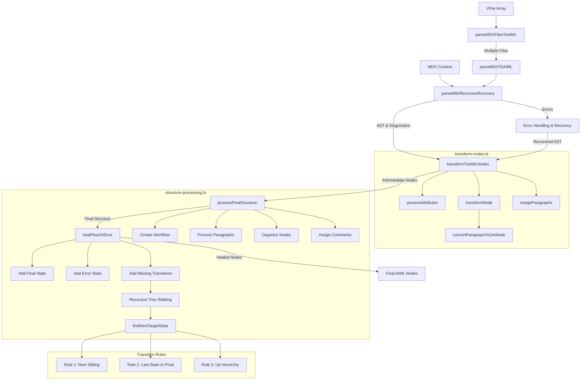

# AIML Parser Package

## Overview

The AIML Parser is responsible for converting MDX content into AIML nodes that can be used by the runtime. The parser handles parsing, transformation, structure processing, and validation of AIML files.

## Code Structure

The parser code has been refactored into a modular architecture for better maintainability and testability:

### Main Files

- **index.ts**: Entry point that exports public APIs and orchestrates the parsing process
- **types.ts**: Contains shared type definitions and interfaces

### Utils Directory

- **utils/helpers.ts**: General utility functions

  - `generateKey()`: Creates unique keys for AIML nodes
  - `resetKeyCounter()`: Resets the key counter
  - `getPosition()`: Extracts position information from nodes
  - `isValidImportPath()`, `resolveImportPath()`: Path-related utilities
  - `fileExistsInVFiles()`: File validation
  - `validateJsxExpression()`: JSX validation functions
  - `parseImportStatement()`: Import statement parsing

- **utils/text-extraction.ts**: Functions for extracting text
  - `extractTextFromNode()`: Extracts text from various node types
  - `serializeJsxToText()`: Converts JSX to text representation

### Parser Directory

- **parser/transform-nodes.ts**: Transformation functions

  - `processAttributes()`: Processes JSX attributes
  - `convertParagraphToLlmNode()`: Converts paragraphs to LLM elements
  - `transformToAIMLNodes()`: Main transformation function
  - `transformNode()`: Handles individual node transformation
  - `mergeParagraphs()`: Combines adjacent paragraph nodes

- **parser/structure-processing.ts**: Structure processing

  - `processFinalStructure()`: Organizes the node tree
  - `assignCommentsToElement()`: Handles comments assignment
  - `healFlowOrError()`: Handles workflow state transitions
  - `findNextTargetState()`, `findParentOf()`, `findNextSibling()`: Tree navigation
  - `hasConditionlessTransition()`, `addTransitionsRecursively()`: Transition handling

## Processing Pipeline

1. **Parsing**: MDX is parsed using remark plugins
2. **Error Recovery**: Handles missing closing tags and other parsing errors
3. **Transformation**: Converts parsed nodes to AIML intermediate structure
4. **Structure Processing**: Creates the final structure with proper relationships
5. **Workflow Healing**: Ensures all states have proper transitions

## Parser Flow Diagram



## Workflow Healing

The `healFlowOrError` phase ensures:

1. Every workflow has a final state and error state
2. States without conditionless transitions get appropriate transitions based on these rules:
   - Direct children of workflow transition to their next sibling
   - The last direct child of workflow transitions to the final state
   - Nested states transition to their next sibling
   - Last nested state transitions to the parent's next sibling or up the hierarchy

## Usage

```typescript
import { parseMDXToAIML } from "@aiml/parser";

const result = await parseMDXToAIML(mdxContent, {
  filePath: "myfile.aiml",
  generateIds: true,
});

// result contains nodes and diagnostics
```

For multiple files with imports:

```typescript
import { parseMDXFilesToAIML } from "@aiml/parser";

const result = await parseMDXFilesToAIML(files);
```
