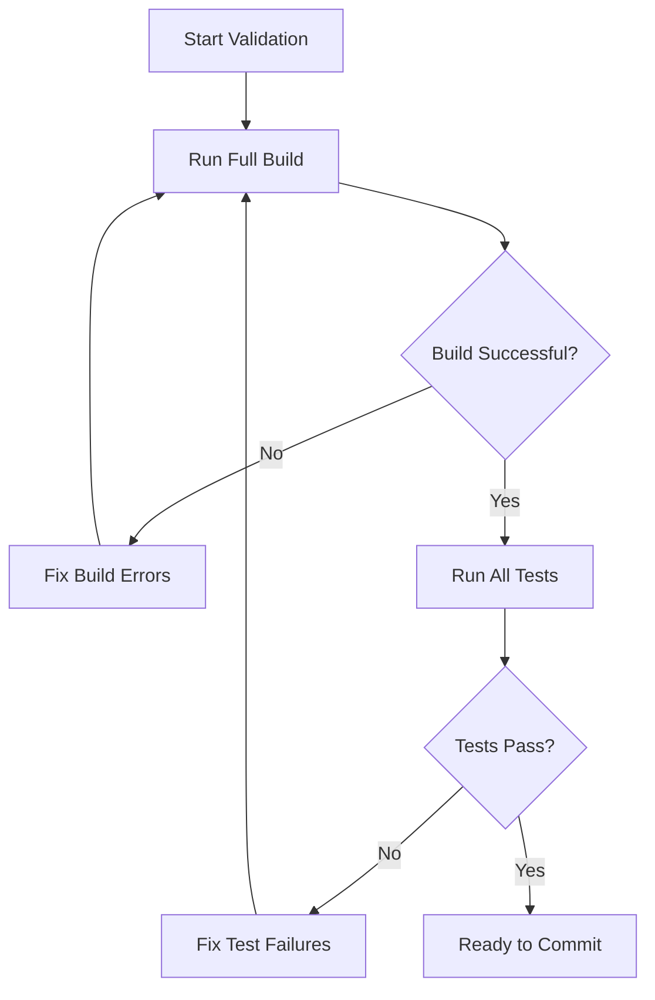

# Build Integrity Guide for AIML

## Core Principle

**No coding task is considered complete unless all packages build and all tests pass.**

This guide establishes the processes and practices to enforce build integrity across the AIML project.

## Pre-Commit Validation Process

Before committing any code changes, developers must follow this validation process:



## Build Validation Commands

The following commands must be run and pass successfully before any code is committed:

1. **Full Build Validation:**

   ```bash
   bun run build
   ```

   This will build all packages in the correct dependency order as defined in turbo.json.

2. **Full Test Suite:**

   ```bash
   bun test
   ```

   This will run all tests across all packages.

3. **Combined Validation (Recommended):**
   ```bash
   bun run validate
   ```
   This runs both build and test in the correct sequence and fails if either step fails.

## Adding the Validation Script

Add this script to the root `package.json`:

```json
"scripts": {
  "validate": "bun run build && bun test"
}
```

## Build Failure Resolution Process

When encountering build failures:

1. **Identify the Failed Package(s):**

   - Check the build output to identify which package(s) failed
   - Note the specific errors reported

2. **Resolve Dependencies First:**

   - If a dependency package failed, fix that first before addressing dependent packages
   - Refer to the dependency order in turbo.json

3. **Common Build Issues:**
   - Type errors: Ensure types are correctly defined and used
   - Missing dependencies: Check package.json for missing dependencies
   - Import errors: Verify import paths and exported members
   - Configuration issues: Check tsconfig.json for correct settings

## Test Failure Resolution Process

When tests fail:

1. **Identify the Failed Test(s):**

   - Note the specific test file and test case that failed
   - Understand the assertion that failed and why

2. **Resolve Test Issues:**

   - If your changes broke existing tests, either:
     - Fix your code to maintain expected behavior, or
     - Update tests to reflect intentional behavior changes (only if requirements changed)
   - If new tests are failing, fix implementation to match requirements

3. **Verify Fixes:**
   - Re-run the specific failed test to confirm your fix: `bun test path/to/test/file.test.ts`
   - Run the full test suite to ensure no regressions: `bun test`

## Continuous Integration

For automated enforcement of build integrity, CI should be configured to:

1. Run on all pull requests and pushes to main branches
2. Block merges if builds or tests fail
3. Report build/test status clearly in PR reviews
4. Optionally generate and report test coverage metrics

Recommended CI configuration:

```yaml
# Example CI configuration (conceptual)
steps:
  - name: Setup
    run: bun install

  - name: Build
    run: bun run build
    fail-fast: true

  - name: Test
    run: bun test
    fail-fast: true
```

## Package Interdependency Considerations

Due to the hierarchical nature of AIML packages:

1. **Changes to Lower-Level Packages:**

   - Changes to packages like `@fireworks/types` affect all other packages
   - Test and build all dependent packages when modifying a lower-level package

2. **Dependency Order for Troubleshooting:**

   - Always fix issues in the following order:
     1. types
     2. element-config
     3. shared
     4. elements
     5. runtime
     6. parser

3. **Interface Stability:**
   - Exercise caution when modifying interfaces in lower-level packages
   - Document interface changes clearly and update dependent packages accordingly

## Build Performance Optimization

To maintain efficient development workflow:

1. **Targeted Testing During Development:**

   - Use `bun test path/to/specific/test.ts` for quick feedback
   - Full validation is still required before commit

2. **Turbo Cache:**

   - Leverage Turborepo's caching for faster builds
   - Run `bun run clean` if experiencing stale cache issues

3. **Watch Mode for Development:**
   - Use `bun run dev` for active development
   - Still verify with full build/test before committing

## Code Review Checklist

When reviewing PRs, verify that:

- [ ] All builds pass successfully
- [ ] All tests pass successfully
- [ ] New code has appropriate test coverage
- [ ] TDD process was followed (tests commit should precede implementation)
- [ ] No untested code was added
- [ ] Build performance was not significantly degraded

## Emergency Hotfix Protocol

In rare emergency situations requiring immediate fixes:

1. The fix must still build successfully
2. Tests must be added immediately after the fix
3. A follow-up PR must be created to increase test coverage
4. The emergency nature must be documented in the PR

## Example: Fixing a Failed Build

```bash
# 1. Attempt to build all packages
bun run build

# Output shows error in @fireworks/elements package

# 2. Fix the issue in packages/elements/src/problem-file.ts

# 3. Build just the affected package to verify fix
cd packages/elements
bun run build

# 4. Return to root and verify full build
cd ../..
bun run build

# 5. Run tests to ensure no regressions
bun test

# 6. Ready to commit the fix
```
