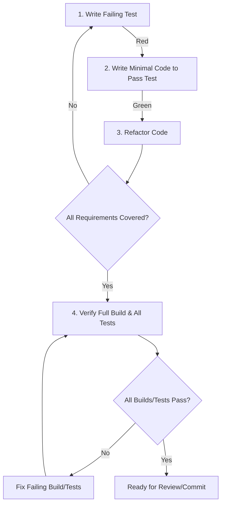

# Test-Driven Development Workflow for AIML

## TDD Process Overview

Test-Driven Development is a software development approach where tests are written before the actual code. For the AIML project, all package development must follow this workflow:



## Red-Green-Refactor Cycle

### 1. RED: Write a Failing Test

- Create a test file if it doesn't exist (see naming conventions below)
- Write a test that defines the expected behavior of the code
- The test should fail since the functionality doesn't exist yet
- Include assertions that clearly demonstrate the expected behavior
- Run the test to confirm it fails (`bun test path/to/test/file.test.ts`)

### 2. GREEN: Write Minimal Implementation

- Write just enough code to make the test pass
- Focus on functionality, not optimization or elegance at this stage
- Run the test again to confirm it passes
- If it still fails, modify the implementation (not the test) until it passes

### 3. REFACTOR: Improve the Code

- Once the test passes, improve the code without changing its behavior
- Remove duplication, improve naming, optimize performance if needed
- Run the test after each refactoring step to ensure it still passes
- This is where you ensure the code meets quality standards

### 4. VERIFY: Full Project Validation

- After completing the feature or fix, run the full test suite (`bun test`)
- Ensure all packages build (`bun run build`)
- Fix any issues found in other tests or builds before proceeding

## Test File Conventions

### Location and Naming

- Place test files adjacent to the implementation files they test
- Name test files with the `.test.ts` or `.spec.ts` suffix
- For example:
  - Implementation: `packages/elements/src/ai/LLMElement.tsx`
  - Test: `packages/elements/src/ai/LLMElement.test.tsx`

### Organization

- Group tests using `describe` blocks for logical organization
- Use nested `describe` blocks for complex components
- Name tests clearly using `it` or `test` with descriptive names
- Example:
  ```typescript
  describe('LLMElement', () => {
    describe('initialization', () => {
      it('should initialize with default properties when none are provided', () => {...});
      it('should use provided properties when available', () => {...});
    });

    describe('process method', () => {
      it('should handle streaming responses correctly', () => {...});
      it('should properly transform input data', () => {...});
    });
  });
  ```

## Test Coverage Expectations

- All new code must have test coverage
- Core functionality should aim for 90%+ coverage
- Edge cases and error handling should be explicitly tested
- Complex logic requires comprehensive test cases
- Aim to test both success and failure paths

## Minimal Mocking Guidelines

### When to Use Real Implementations

- Use real implementations for:
  - Core utility functions
  - Simple, pure functions with no side effects
  - Classes/objects within the same package with few dependencies
  - Functions that are central to the feature being tested

### When to Use Mocks

- Use mocks sparingly for:
  - External services (APIs, databases)
  - Cross-package dependencies that would create circular test dependencies
  - Components that have complex side effects
  - Time-dependent or non-deterministic operations

### Creating Effective Minimal Mocks

- Mock only what's necessary for the test
- Create focused mocks that implement just the interface needed
- Avoid deep nesting of mocks
- Prefer stubbing specific methods rather than entire objects

### Example: Minimal Mock for LLMElement Dependencies

```typescript
// Instead of mocking the entire StepValue class:
const minimalStepValueMock = {
  getValue: () => "test response",
  isStreaming: () => false,
};

// Instead of a complex mock implementation:
const createExecutionContextMock = () => ({
  getStreamController: jest.fn().mockReturnValue({
    push: jest.fn(),
    complete: jest.fn(),
  }),
});
```

## Testing Interdependent Packages

Due to the hierarchical nature of the AIML packages, testing requires special attention:

1. **Bottom-up Testing**:

   - Focus on thoroughly testing lower-level packages first (types, element-config)
   - Higher-level packages can then rely on well-tested lower-level packages

2. **Integration Testing Strategy**:

   - Create targeted integration tests for critical paths that cross package boundaries
   - These tests should verify that the interfaces between packages work correctly

3. **Avoiding Circular Dependencies in Tests**:
   - If package A depends on package B, package B's tests should not depend on package A
   - Use interfaces and minimal mocks to break circular testing dependencies

## Build Verification Process

Before submitting any code changes:

1. Run `bun run build` to verify all packages build successfully
2. Run `bun test` to verify all tests pass across packages
3. Address any build failures or test failures before committing

## Troubleshooting Common TDD Issues

### Failing Tests

- Check that implementation matches test expectations
- Verify that tests are correctly set up and assertions are valid
- Ensure dependencies are correctly mocked or available

### Build Failures After Tests Pass

- Check for TypeScript errors that may not affect runtime but prevent compilation
- Verify imports/exports are correctly defined
- Check that package.json dependencies are correctly specified

### Circular Dependencies

- Identify the circular reference path
- Consider refactoring to eliminate the circular dependency
- Use dependency injection or interfaces to break cycles
